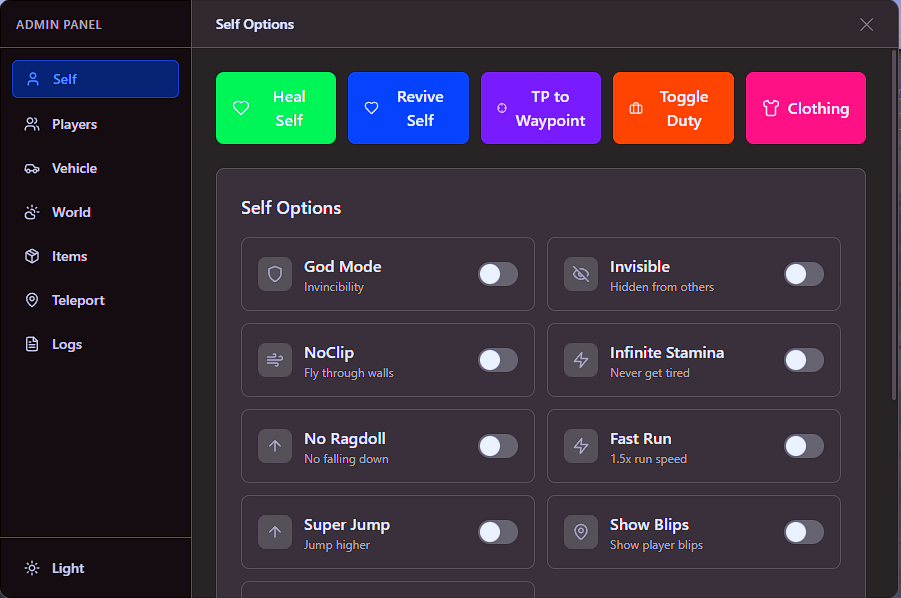

# 🎮 FiveM Admin Panel


Admin Panel modern untuk FiveM dengan dukungan multi-framework (QBCore & ESX), multi-inventory, dan multi-clothing system.

---

## 📸 Preview

<div align="center">

| Self Menu | Players Menu | Vehicle Menu |
|:---------:|:------------:|:------------:|
|  |  |  |

| Items Menu | Teleport Menu | World Menu |
|:----------:|:-------------:|:----------:|
|  |  |  |

| Logs Menu |
|:---------:|
|  |

</div>

---

## ✨ Features

### 🧍 Self Options
- **God Mode** - Kebal dari semua damage
- **Invisible** - Tidak terlihat oleh player lain
- **Noclip** - Terbang menembus objek
- **Infinite Stamina** - Stamina tak terbatas
- **No Ragdoll** - Tidak bisa jatuh/terpental
- **Fast Run** - Lari lebih cepat
- **Super Jump** - Lompat tinggi
- **Show Player Blips** - Tampilkan semua player di map
- **Show Player Names** - Tampilkan nama player di atas kepala
- **Heal Self** - Sembuhkan diri sendiri
- **Revive Self** - Hidup kembali dari keadaan mati
- **TP to Waypoint** - Teleport ke marker di map
- **Copy Coordinates** - Salin koordinat lokasi saat ini
- **Open Clothing Menu** - Buka menu pakaian

### 👥 Player Management
- **View All Players** - Lihat daftar semua player online
- **Give Money** - Berikan uang ke player (cash/bank/crypto)
- **Remove Money** - Hapus uang dari player
- **Give Car** - Spawn kendaraan untuk player
- **Give Item** - Berikan item ke player
- **Give Clothing Menu** - Buka menu pakaian untuk player
- **Spectate Player** - Lihat aktivitas player secara live
- **Freeze Player** - Bekukan player di tempat
- **Kick Player** - Keluarkan player dari server
- **Ban Player** - Banned player (temporary/permanent)
- **Make Player Drunk** - Buat player mabuk
- **Remove Stress** - Hapus stress player
- **Revive in Radius** - Hidup semua player dalam radius
- **Set Player Ped** - Ubah model ped player
- **Set Routing Bucket** - Pindahkan player ke dimension lain
- **Open Player Inventory** - Buka inventory player
- **Clear Inventory** - Hapus semua item player
- **Fix Player Vehicle** - Perbaiki kendaraan player

### 🚗 Vehicle Management
- **Spawn Vehicle** - Spawn kendaraan dengan search
- **Delete Vehicle** - Hapus kendaraan saat ini
- **Repair Vehicle** - Perbaiki kendaraan
- **Flip Vehicle** - Balikkan kendaraan yang terbalik
- **Max Upgrades** - Upgrade maksimal semua komponen
- **Set Fuel** - Atur level bensin
- **Engine Toggle** - Nyalakan/matikan mesin
- **Lock Toggle** - Kunci/buka kunci kendaraan

### 📦 Items (Give Items)
- **Give Item to Self** - Berikan item ke diri sendiri
- **Give Item to All** - Berikan item ke semua player
- **Give Money to Self** - Berikan uang ke diri sendiri
- **Give Money to All** - Berikan uang ke semua player
- **Open Stash** - Buka stash inventory
- **Open Trunk** - Buka trunk kendaraan

### 🗺️ Teleport
- **Preset Locations** - Teleport ke lokasi preset (City Hall, Hospital, Airport, dll)
- **Teleport to Player** - Teleport ke player lain
- **Teleport Player** - Teleport player ke lokasi tertentu
- **Bring Player** - Bawa player ke lokasi admin

### 🌍 World Options
- **Set Weather** - Ubah cuaca server (Clear, Clouds, Rain, Thunder, Snow, dll)
- **Set Time** - Atur waktu server
- **Freeze Time** - Bekukan waktu
- **Blackout** - Matikan semua lampu kota

### 📋 Logs
- **View Action Logs** - Lihat semua aktivitas admin
- **Filter by Type** - Filter berdasarkan tipe aksi
- **Export to Discord** - Export logs ke Discord webhook
- **Clear Logs** - Hapus semua logs

---

## 🔧 Supported Systems

### Frameworks
| Framework | Support |
|-----------|:-------:|
| QBCore | ✅ |
| ESX | ✅ |

### Inventory Systems
| Inventory | Support |
|-----------|:-------:|
| ox_inventory | ✅ |
| qb-inventory | ✅ |
| qs-inventory | ✅ |
| codem-inventory | ✅ |
| origen_inventory | ✅ |

### Clothing Systems
| Clothing | Support |
|----------|:-------:|
| illenium-appearance | ✅ |
| fivem-appearance | ✅ |
| qb-clothing | ✅ |
| esx_skin | ✅ |
| skinchanger | ✅ |

### Languages (Locales)
| Language | Code |
|----------|:----:|
| English | `en` |
| Indonesian | `id` |
| German | `de` |
| Spanish | `es` |
| French | `fr` |
| Italian | `it` |
| Dutch | `nl` |
| Norwegian | `no` |
| Portuguese (Brazil) | `pt-br` |

---

## 📦 Dependencies

**Required:**
- [ox_lib](https://github.com/overextended/ox_lib) - UI Library & Locale System
- [oxmysql](https://github.com/overextended/oxmysql) - MySQL Database

**One of these frameworks:**
- [qb-core](https://github.com/qbcore-framework/qb-core) - QBCore Framework
- [es_extended](https://github.com/esx-framework/esx-legacy) - ESX Framework

---

## 📥 Installation

### 1. Download & Extract
```bash
# Clone repository
git clone https://github.com/your-username/adminpanel.git

# Atau download ZIP dan extract
```

### 2. Copy ke Resources
Salin folder `adminpanel` ke folder resources server:
```
resources/
├── [standalone]/
│   ├── ox_lib/
│   ├── oxmysql/
├── [admin]/           <-- Buat folder baru (opsional)
│   └── adminpanel/    <-- Taruh disini
```

### 3. Konfigurasi server.cfg
Tambahkan ke `server.cfg`:
```cfg
# Dependencies (pastikan start sebelum adminpanel)
ensure ox_lib
ensure oxmysql
ensure qb-core   # atau es_extended untuk ESX

# Admin Panel
ensure adminpanel

# ACE Permissions
add_ace group.admin adminpanel allow
add_principal identifier.license:xxxx group.admin
```

### 4. Setup Permissions
Edit `shared/config.lua` untuk mengatur permission:
```lua
-- Permission yang dibutuhkan
Config.RequiredPermission = 'admin'  -- 'god', 'admin', atau 'mod'

-- Command untuk buka panel
Config.OpenCommand = 'adminpanel'

-- Keybind (set nil untuk disable)
Config.OpenKey = 'F10'
```

### 5. Konfigurasi Framework & Inventory
```lua
-- Auto-detect (recommended)
Config.Framework = 'auto'   -- 'auto', 'qbcore', 'esx'
Config.Inventory = 'auto'   -- 'auto', 'ox_inventory', 'qb-inventory', etc.
Config.Clothing = 'auto'    -- 'auto', 'illenium-appearance', 'qb-clothing', etc.
```

### 6. Setup Locale (Bahasa)
Edit `fxmanifest.lua`:
```lua
-- Ganti sesuai bahasa yang diinginkan
ox_lib 'locale'

-- Untuk Indonesia:
-- Buka ox_lib/resource/locales.lua dan set:
-- Config.locale = 'id'
```

### 7. Restart Server
```bash
# Di console server
refresh
ensure adminpanel
```

---

## ⚙️ Configuration

### Permission Levels
```lua
Config.PermissionLevels = {
    ['mod'] = 1,    -- Level terendah
    ['admin'] = 2,  -- Level menengah
    ['god'] = 3,    -- Level tertinggi
}
```

### Feature Permissions
Setiap fitur memiliki permission level minimum:
```lua
Config.FeaturePermissions = {
    self = {
        godMode = 'admin',      -- Hanya admin+
        invisible = 'admin',
        noclip = 'admin',
        healSelf = 'mod',       -- Mod bisa akses
    },
    players = {
        banPlayer = 'god',      -- Hanya god
        kickPlayer = 'admin',
        mutePlayer = 'mod',
    },
    -- ... lihat config.lua untuk lengkapnya
}
```

### Teleport Locations
Tambah/edit lokasi preset teleport:
```lua
Config.TeleportLocations = {
    { id = 1, name = 'City Hall', coords = vector3(425.4, -979.8, 29.4) },
    { id = 2, name = 'Police Station', coords = vector3(425.1, -980.5, 29.3) },
    -- Tambahkan lokasi baru
    { id = 9, name = 'Custom Location', coords = vector3(0.0, 0.0, 0.0) },
}
```

### Discord Webhook
Untuk logging ke Discord:
```lua
Config.DiscordWebhook = 'https://discord.com/api/webhooks/xxx/xxx'

Config.DiscordColors = {
    info = 3447003,     -- Biru
    warning = 16776960, -- Kuning
    error = 15158332    -- Merah
}
```

---

## 🎮 Usage

### Opening Admin Panel
- **Command:** `/adminpanel`
- **Keybind:** `F10` (default, configurable)

### Navigation
- Gunakan sidebar untuk berpindah antar menu
- Search bar tersedia di beberapa menu
- Klik di luar panel untuk menutup

### Player Actions
1. Buka menu **Players**
2. Pilih player dari list (bisa search)
3. Pilih action yang ingin dilakukan
4. Konfirmasi jika diperlukan

---

## 📁 Project Structure

```
adminpanel/
├── bridge/
│   ├── client/
│   │   ├── esx.lua          # ESX client bridge
│   │   ├── qb.lua           # QBCore client bridge
│   │   ├── inventory.lua    # Inventory abstraction
│   │   └── clothing.lua     # Clothing abstraction
│   ├── server/
│   │   ├── esx.lua          # ESX server bridge
│   │   ├── qb.lua           # QBCore server bridge
│   │   ├── inventory.lua    # Inventory abstraction
│   │   └── clothing.lua     # Clothing abstraction
│   └── shared.lua           # Framework detection
├── client/
│   ├── core.lua             # Core client functions
│   ├── self.lua             # Self options
│   ├── players.lua          # Player management
│   ├── vehicle.lua          # Vehicle functions
│   ├── teleport.lua         # Teleport functions
│   └── world.lua            # World options
├── server/
│   ├── core.lua             # Core server functions
│   ├── logs.lua             # Logging system
│   ├── players.lua          # Player events
│   ├── vehicle.lua          # Vehicle events
│   ├── world.lua            # World events
│   └── inventory.lua        # Inventory events
├── shared/
│   └── config.lua           # Configuration
├── locales/
│   ├── en.json              # English
│   ├── id.json              # Indonesian
│   ├── de.json              # German
│   └── ...                  # Other languages
├── web/                     # React UI
│   ├── App.tsx
│   ├── components/
│   │   ├── Sidebar.tsx
│   │   └── pages/
│   │       ├── Self.tsx
│   │       ├── Players.tsx
│   │       ├── Vehicle.tsx
│   │       ├── Items.tsx
│   │       ├── Teleport.tsx
│   │       ├── World.tsx
│   │       └── Logs.tsx
│   └── hooks/
│       └── useNui.ts
├── fxmanifest.lua
└── README.md
```

---

## 🔒 Security

- **ACE Permissions** - Menggunakan sistem permission FiveM
- **Server-side Validation** - Semua aksi divalidasi di server
- **Permission Checks** - Setiap fitur dicek permission-nya
- **Action Logging** - Semua aksi admin tercatat di logs
- **Discord Webhook** - Optional logging ke Discord

---

## 🐛 Troubleshooting

### Panel tidak muncul
1. Pastikan `ox_lib` sudah di-start sebelum `adminpanel`
2. Cek console untuk error
3. Pastikan ACE permission sudah di-setup

### Inventory tidak bekerja
1. Pastikan inventory resource sudah running
2. Set `Config.Inventory` ke nama inventory yang benar
3. Restart resource

### Framework tidak terdeteksi
1. Pastikan framework di-start sebelum `adminpanel`
2. Set `Config.Framework` manual jika auto tidak bekerja

### Locales tidak muncul
1. Pastikan `ox_lib/resource/locales.lua` dikonfigurasi dengan benar
2. Cek apakah file locale JSON valid

---

## 📄 License

MIT License - Bebas digunakan, dimodifikasi, dan didistribusikan.

---

## 🤝 Credits

- **ox_lib** - UI & Locale system
- **QBCore/ESX** - Framework support
- **Tailwind CSS** - Styling
- **React** - UI Framework

---

## 📞 Support

- **Issues:** [GitHub Issues](https://github.com/your-username/adminpanel/issues)
- **Discord:** [Join Server](https://discord.gg/your-server)

---

<div align="center">

Made with ❤️ for FiveM Community

</div>
